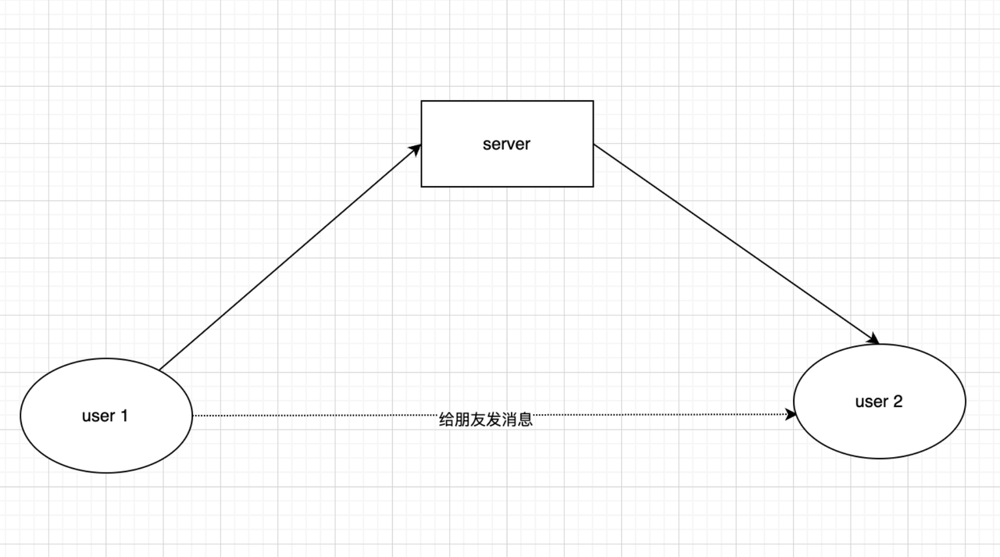
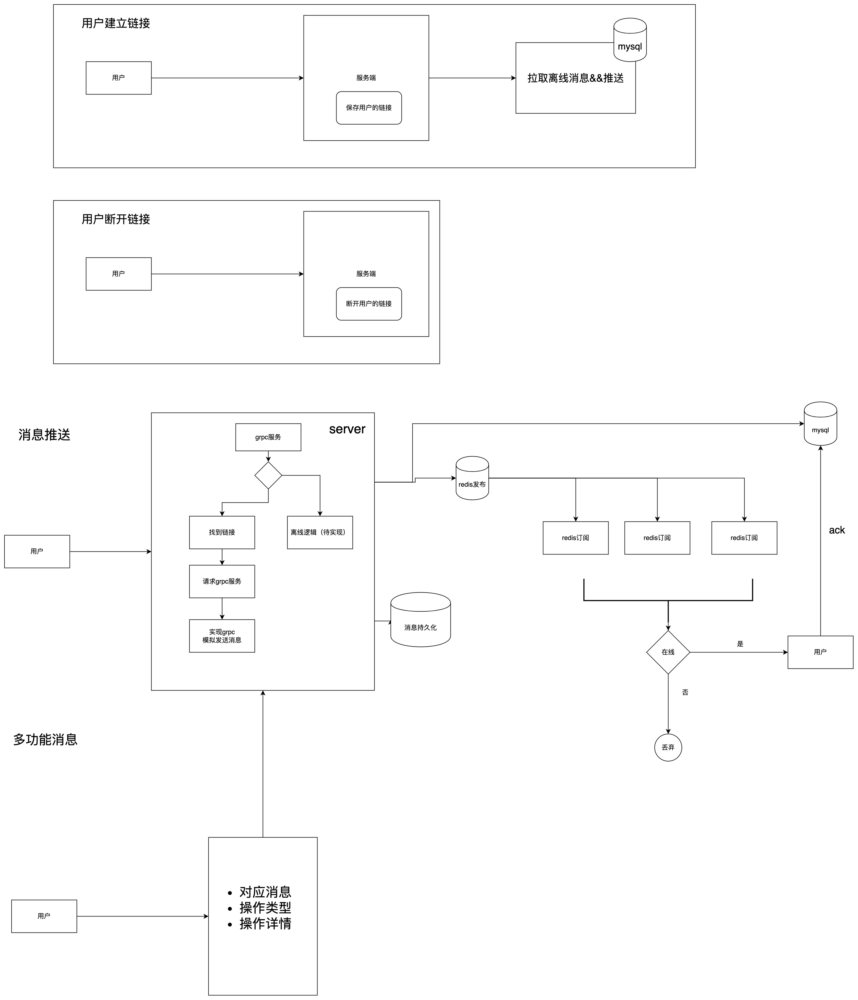
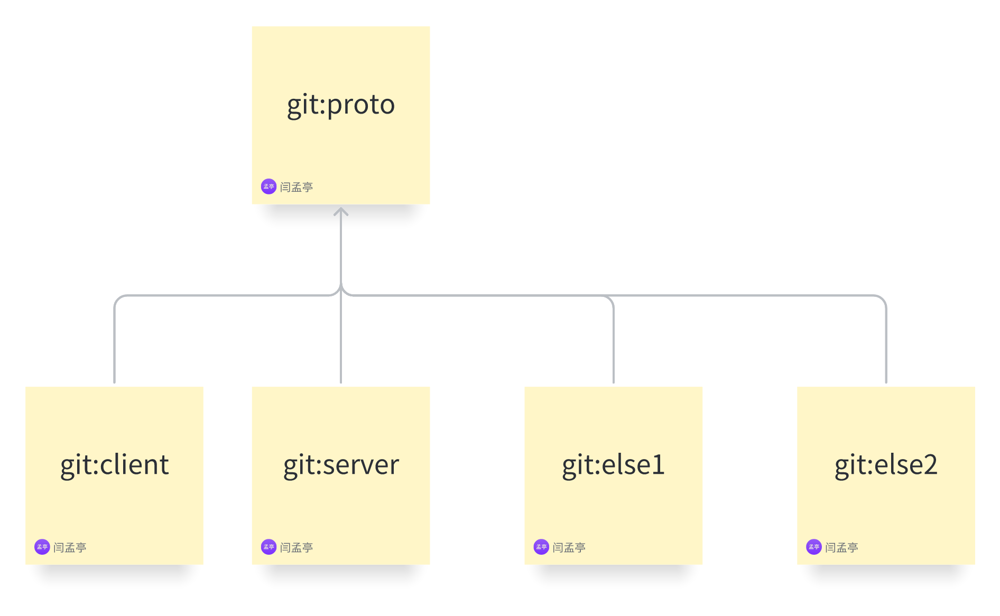
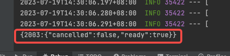
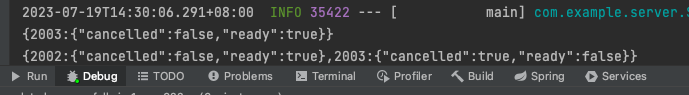
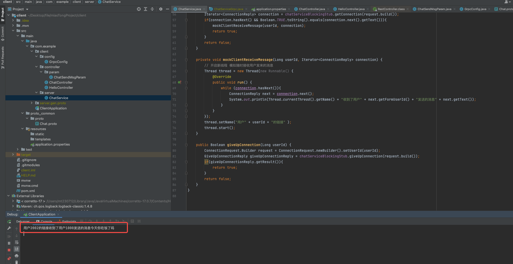
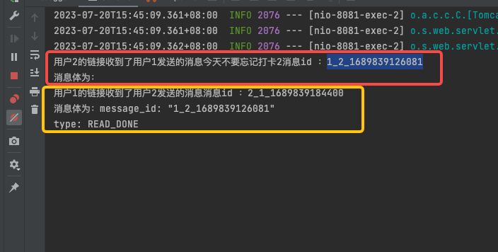
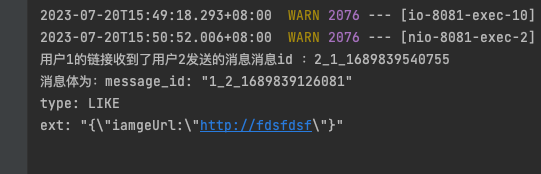

# 基于GRPC，搭建用户私聊项目demo
## 开发环境
* springboot3 + jdk17 + redis + mysql 
## 项目关系
* [clent](https://github.com/mojieafei/client) 
  * 代替客户端，进行方法的调用
* [server](https://github.com/mojieafei/server)
  * 作为服务端，主项目
* [proto_common](https://github.com/mojieafei/proto_common)
  * 存放proto文件，应用于以上项目的子项目submodule

## 需求描述
* 使用 grpc 实现 A <-> B 互相发送消息
* 

## 设计
 
- demo比较简单，用户A  http请求向用户B发送消息，业务收到请求之后，调用grpc服务进行消息的发送，通过在服务端找到对应接收方的id的长链接，进行消息的推送
- Springboot3  +  grpc + java 17
- proto文件由git子项目submodule进行管理，方便不同项目之间的proto同步
- 
- - 长链接的形式为服务端流，找到链接之后，通过onNext进行消息推送
- 复杂消息可以对消息进行功能性扩展，比如修改已读状态、回复、点赞等等
- 分布式服务器推送，采取第二个方案
    - 第一个方案 采用全局缓存，存放用户id：机器唯一id
        - 有两个难点 1⃣️ 获取机器id之后如何请求进去？2⃣️某一台机器挂了，如何清理缓存？
    - 第二个方案 所有服务器订阅redis，拿到消息后，检查自己是否持有链接，是则执行，不是则放过
        - 难点 离线处理消息

## 项目启动
* 先启动redis + mysql ，然后再启动对应项目中的Application即可
## 项目测试
### 建立id为 2003用户的链接
```agsl
curl --location 'localhost:8081/chat/getConnection?userId=2003'
```


### 2003用户离线
```
curl --location 'localhost:8081/chat/giveUpConnection?userId=2'
```

### 发送消息
```
- 用id代替发送方和接收方
  curl --location 'localhost:8081/chat/sendMsgToSomeOne' \
  --header 'Content-Type: application/json' \
  --data '{
  "fromUserId":1000,
  "toUserId":2002,
  "text":"今天你吃饭了吗"
  }'
```

### 用户已读回执

### 用户点赞
